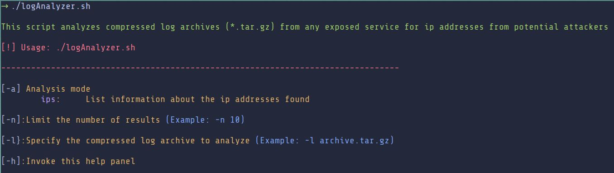
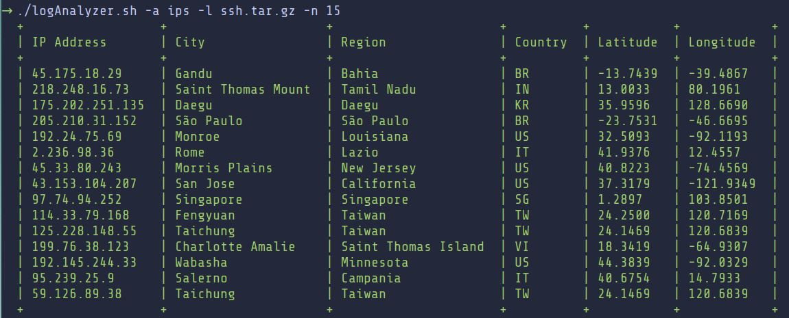
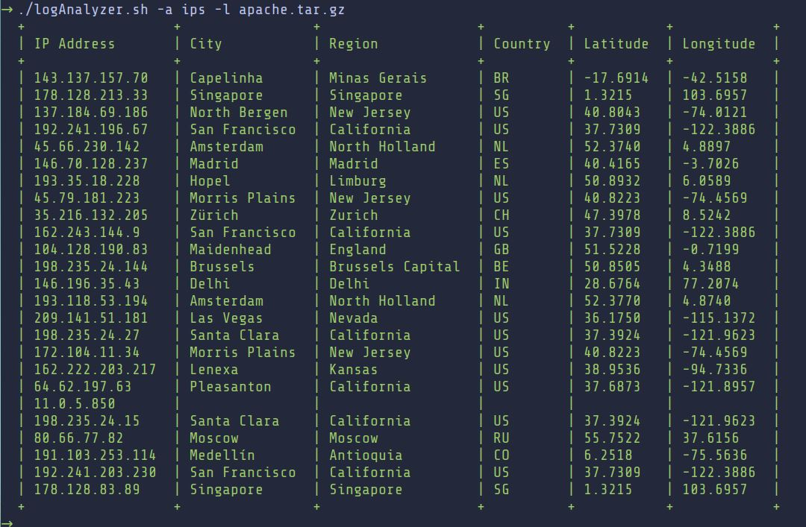

# logAnalyzer
**logAnalyzer** is a tool written in bash that searches an exposed service's compressed tarball for ips and displays its geolocation data.

Prerequisites
===
Before executing this tool, it's necessary to have installed the 7-Zip file archiver. 
Additionally, the geolocation data of each ip is fetched from ipinfo.io's IP Geolocation API. It offers 50,000 free IP geolocation lookups per month. More than enough to succesfully run this script.

How to execute the script?
===
For starters, executing the script without parameters displays the following:

The flags are the following:
* `-a` indicates the search for ips in the log compressed archives and lists the information found for each one.   
* `-l` receives the compressed tarball to isnpect.
* `-n` limits the output produced. By default, the serach is narrowed down to 25 entries.
* `-h` invokes the help panel displayed above

Example usage
===

Finally, two tarballs, ssh and apache, have been uploaded to execute the program on.
